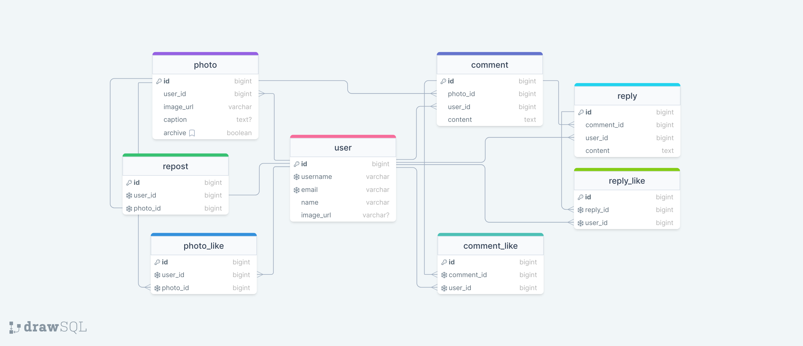

<a name="readme-top"></a>

<div align="center">
  
  <br/>
  <h1><b>README</b></h3>

</div>

<!-- TABLE OF CONTENTS -->

# 📗 Table of Contents

- [📖 About the Project](#about-project)
  - [🛠 Built With](#built-with)
    - [Tech Stack](#tech-stack)
    - [Key Features](#key-features)
  - [🚀 Live Demo](#live-demo)
- [🎥 Video Demonstration](#video-demo)
- [💻 Getting Started](#getting-started)
  - [Prerequisites](#prerequisites)
  - [Setup](#setup)
  - [Install](#install)
  - [Usage](#usage)
  - [Run tests](#run-tests)
- [👥 Authors](#authors)
- [🔭 Future Features](#future-features)
- [🤝 Contributing](#contributing)
- [⭐ Show your support](#support)
- [🙏 Acknowledgements](#acknowledgements)
- [📝 License](#license)

<!-- PROJECT DESCRIPTION -->

# 📖 I-SHARE <a name="about-project"></a>

i-share is an engaging full-stack project designed for sharing photos online. Post, star, and connect with fellow photography enthusiasts through our seamless backend that powers the platform. Explore the frontend side [here](https://github.com/mohametalmeari/i-share-frontend). Join i-share to share moments and enjoy a visual feast from around the world. 📸✨



## 🛠 Built With <a name="built-with"></a>

### Tech Stack <a name="tech-stack"></a>

<details>
  <summary>Framework</summary>
  <ul>
    <li><a href="https://rubyonrails.org/">Rails</a></li>
  </ul>
</details>

<details>
<summary>Database</summary>
  <ul>
    <li><a href="https://www.postgresql.org/">PostgreSQL</a></li>
  </ul>
</details>

<!-- Features -->

### Key Features <a name="key-features"></a>

- *Publish Photos*
- *Give Photos Stars*
- *Comment on Photos*
- *Reply to Comments*
- *Like Comments and Relies*

<p align="right">(<a href="#readme-top">back to top</a>)</p>

<!-- LIVE DEMO -->

## 🚀 Live Demo <a name="live-demo"></a>

 - [Live Demo Link](https://i-share-almeari.onrender.com)

<p align="right">(<a href="#readme-top">back to top</a>)</p>

<!-- GETTING STARTED -->

## 💻 Getting Started <a name="getting-started"></a>

### Prerequisites

In order to run this project you need:

```sh
  gem install bundler
```

### Setup

Clone this repository to your desired folder:

```sh
  cd my-folder
  git clone https://github.com/mohametalmeari/i-share-api.git
```

### Install

Install this project with:

```sh
  cd i-share-api
  bundle install
```

### Usage

To run the project, execute the following command:

```sh
  rails server
```

<!-- ### Run tests

To run tests, run the following command:

```sh
  rspec spec
``` -->

<p align="right">(<a href="#readme-top">back to top</a>)</p>

<!-- AUTHORS -->

## 👥 Authors <a name="authors"></a>

👤 *Mohamad*

- GitHub: [@mohametalmeari](https://github.com/mohametalmeari)
- Twitter: [@MohametAlmeari](https://twitter.com/MohametAlmeari)
- LinkedIn: [mohamet-almeari](https://www.linkedin.com/in/mohamet-almeari)

<p align="right">(<a href="#readme-top">back to top</a>)</p>

<!-- FUTURE FEATURES -->

## 🔭 Future Features <a name="future-features"></a>

- Create **API documentation** page

<p align="right">(<a href="#readme-top">back to top</a>)</p>

<!-- CONTRIBUTING -->

## 🤝 Contributing <a name="contributing"></a>

Contributions, issues, and feature requests are welcome!

Feel free to check the [issues page](https://github.com/mohametalmeari/i-share-api/issues).

<p align="right">(<a href="#readme-top">back to top</a>)</p>

<!-- SUPPORT -->

## ⭐ Show your support <a name="support"></a>

If you like this project, please give it a star ⭐.

<p align="right">(<a href="#readme-top">back to top</a>)</p>

<!-- ACKNOWLEDGEMENTS -->

## 🙏 Acknowledgments <a name="acknowledgements"></a>

- [drawSQL](drawsql.app) was used to create the schema diagram.

<p align="right">(<a href="#readme-top">back to top</a>)</p>

<!-- LICENSE -->

## 📝 License <a name="license"></a>

This project is [MIT](MIT.md) licensed.

<p align="right">(<a href="#readme-top">back to top</a>)</p>